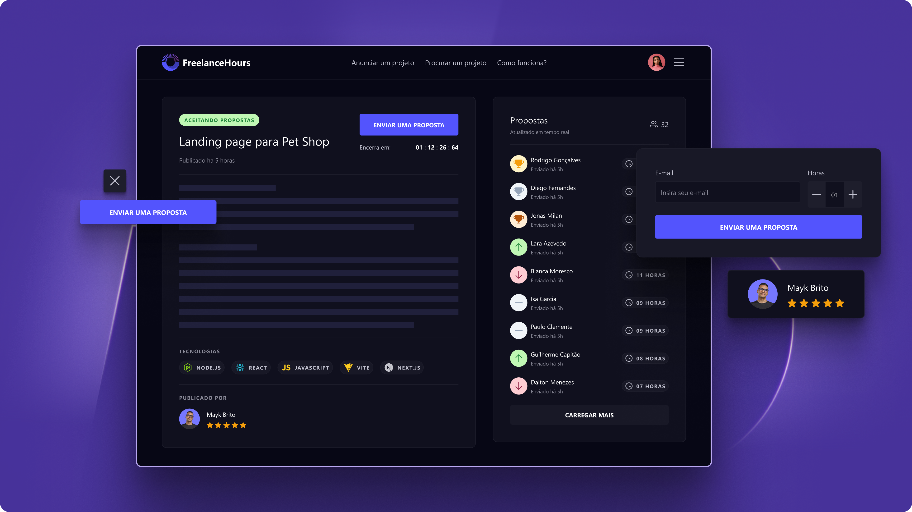

# Freelance Hours

  
    

## Sobre
FreelanceHours é uma aplicação desenvolvida em PHP, Laravel e Livewire, onde freelancers podem enviar propostas de horas que podem contribuir em determinado projeto.  

## Layout

  

## Tecnologias utilizadas

- [**PHP**](https://www.php.net/): Linguagem de programação usada;
- [**Laravel**](https://laravel.com/): Framework PHP utilizado para a estrutura e organização do projeto;
- [**Livewire**](https://laravel-livewire.com/): Utilizado para criar interfaces dinâmicas e reativas sem sair do Laravel;
- [**Tailwind**](https://tailwindcss.com/): Framework CSS que facilita o desenvolvimento de interfaces modernas e responsivas.

## Licença e Agradecimentos
- Este projeto está licenciado sob a licença MIT.
- Esta aplicação foi desenvolvida durante o evento PHP na Prática da [**Rocktseat**](https://app.rocketseat.com.br/?type=ALL).

